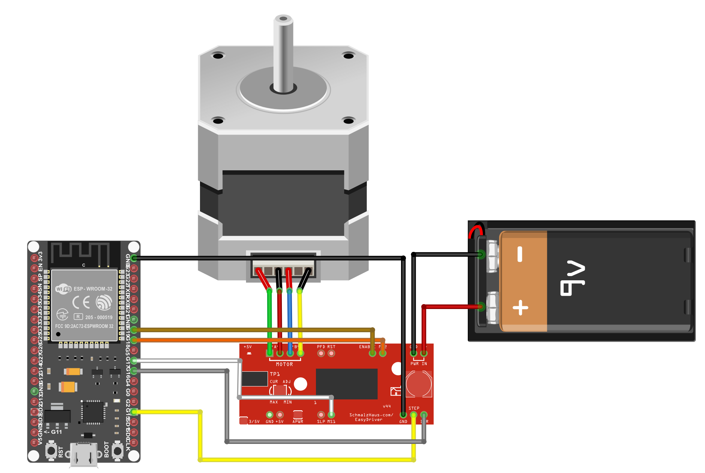

# Spinning Tree
This small project sets your miniature christmas tree (or something else) spinning!

## Step by step
### 1. Components
The project uses the following components:
1. ESP32 dev board
2. Step motor (https://www.sparkfun.com/products/9238)
3. EasyDriver - Stepper Motor Driver (https://www.sparkfun.com/products/12779)
4. Battery power supply (at least 7V).
5. Something to connect everything. I used
	1. A breadboard
	2. M/M jumper cables
6. Something to spin

### 2. Putting everything together

Put everything together as shown in the image. The ESP32 pin connection to the EasyDriver are as follows:
- GPIO15 > STEP
- GPIO16 > DIR
- GPIO17 > MS1
- GPIO18 > MS2
- GPIO19 > ENABLE



### 3. Running the program
Prepare the open source Toit language by following the steps [here](https://github.com/toitlang/toit).

Compile an ESP32 image from the program:
```
cd <path-to-toit-lang>
make esp32 ESP32_ENTRY=<path-to-spin-tree>/spin-tree/src/main.toit
```
Flash the program by pasting the output from `make esp32` into the terminal.

### 4. Enjoy the festivities
Once the program has been flashed, it will start running every time the ESP32 is powered on.

## Useful links
- The stepper motor driver has been compiled into a Toit package: https://github.com/toitware/toit-A3967
- I used this guide to figure out how to wire up the stepper motor with the driver: https://learn.sparkfun.com/tutorials/easy-driver-hook-up-guide
- The EasyDriver webpage provided the step resolution values: http://www.schmalzhaus.com/EasyDriver/
